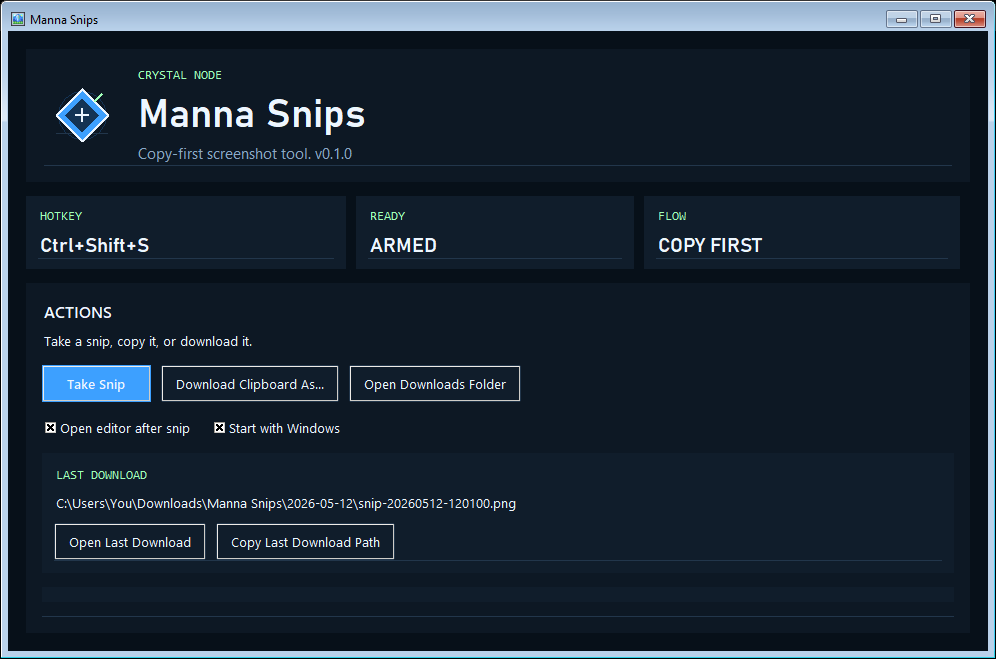
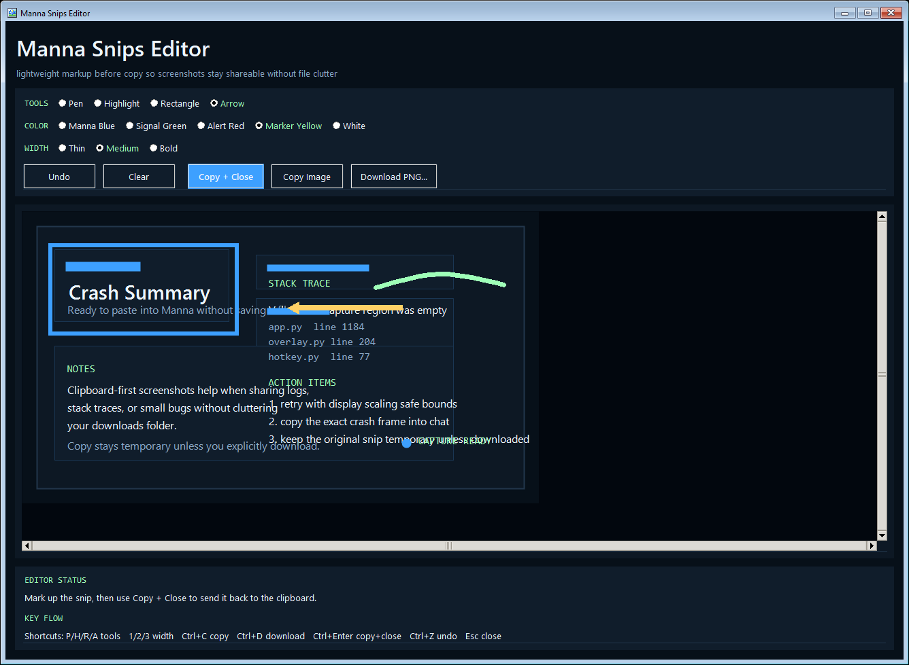

# Manna Snips

Copy-first Windows screenshots with lightweight markup.

`Manna Snips` is a small Windows screenshot tool for people who mostly want to copy screenshots, not manage screenshot files.

It is built for one fast path:

1. Take a snip.
2. Mark it up if needed.
3. Copy it.
4. Paste it where you need it.

Downloads are explicit. Copy stays temporary.

That makes it especially useful for:

- bug reports and support chats
- sharing logs, errors, and UI issues in Discord, Slack, Reddit, or email
- quick screenshots for docs, tickets, and notes
- anyone who is tired of save-heavy screenshot workflows

## Why It Exists

Most screenshot tools are honest about capture, but not always honest about storage. `Manna Snips` is designed around a simpler promise:

- `Copy` should feel temporary
- `Download` should be explicit
- the app should stay local
- the workflow should stay fast

If you just want to grab part of the screen, draw one arrow, and paste it somewhere, that should be the default path.

## Preview





## Install

Download from the [latest release page](https://github.com/manna-core/manna-snips/releases/latest).

Recommended:

- the latest `MannaSnips-*-Setup.exe` installer asset on the release page

Also available:

- portable zip for people who prefer a no-installer lane

The installer:

- lets you choose the install folder
- can enable `Start with Windows after install`
- installs the app with a bundled local Python runtime

Inside the app, you can also:

- change the capture hotkey
- change the downloads folder
- turn `Start with Windows` on or off later
- see the install folder
- see the settings and temp folder

If `Start with Windows` is enabled, `Manna Snips` launches minimized to the taskbar.

## What Makes It Different

- `Copy` does not mean "quietly save another permanent PNG somewhere"
- `Download` is the only action that creates a durable file on disk
- the editor is built for quick arrows, boxes, highlights, and markup, not heavyweight design work
- settings, temp files, and downloads are visible and user-controlled
- the app is local-first with no account system, sync layer, or telemetry

This is closer to a better snipping tool than a full image editor.

## Use

1. Open `Manna Snips`.
2. Leave it open or minimized.
3. Press your capture shortcut. Default: `Ctrl+Shift+S`.
4. Drag a region.
5. Copy it back to the clipboard.
6. Paste with `Ctrl+V`.

If your desktop already uses `Ctrl+Shift+S`, open the app and pick another preset from `SHORTCUT`.

Main behavior:

- `Copy` is temporary and clipboard-first.
- `Download` is the only path that creates a durable PNG on disk.
- Scratch files are disposable and cleaned automatically.

## Good Fit

`Manna Snips` is a good fit if you want:

- a simple Windows utility that stays out of the way
- a fast path from screen region to clipboard
- lightweight built-in annotation
- an installable app that does not require you to already have Python

It is not trying to replace full image editors or team screenshot platforms.

## What It Does

- Global capture hotkey while the app is running, with in-app preset switching
- Custom drag-to-select overlay
- Lightweight built-in editor
- Pen, highlight, rectangle, and arrow tools
- Clipboard-first export
- Explicit PNG download path
- Local-only state and scratch files

## Platform

- Windows
- Python `3.11+`

## Fresh Profile Testing

If you want to test the app like a new user on the same machine:

```powershell
py -3 scripts\manna_snips_app.pyw --profile public-test
```

That keeps settings, temp files, and default downloads separate from the default profile.

## Local Development

Run from source:

```powershell
py -3 scripts\manna_snips_app.pyw
```

Smoke:

```powershell
py -3 scripts\manna_snips_app.pyw --smoke
```

Fresh-profile smoke:

```powershell
py -3 scripts\manna_snips_app.pyw --profile public-test --smoke
```

Version:

```powershell
py -3 scripts\manna_snips_app.pyw --version
```

Compile check:

```powershell
py -3 -m py_compile src\manna_snips\app.py scripts\manna_snips_app.pyw
```

Refresh the README screenshots:

```powershell
powershell -ExecutionPolicy Bypass -File scripts\capture-readme-assets.ps1
```

## Build The Installer

```powershell
powershell -ExecutionPolicy Bypass -File scripts\build-installer.ps1
```

That script builds:

- the installer under `dist\installer\`
- a SHA-256 file for the installer beside it

This is the preferred public release path.

## Advanced: Portable Build

```powershell
powershell -ExecutionPolicy Bypass -File scripts\build-release.ps1
```

That script builds:

- a PyInstaller `onedir` folder under `dist\MannaSnips`
- a versioned zip under `dist\`
- a SHA-256 file for the release zip beside it

The portable build is still a secondary lane. The installer is the preferred release shape.

## Privacy

`Manna Snips` is designed as a local-first tool:

- no telemetry
- no cloud sync
- no automatic uploads
- no account system

See [PRIVACY.md](PRIVACY.md).
